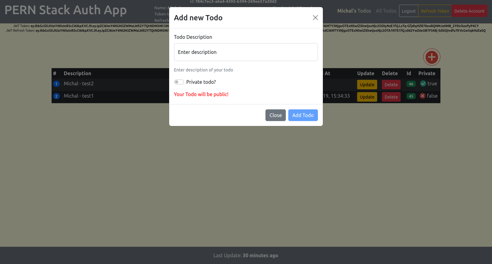
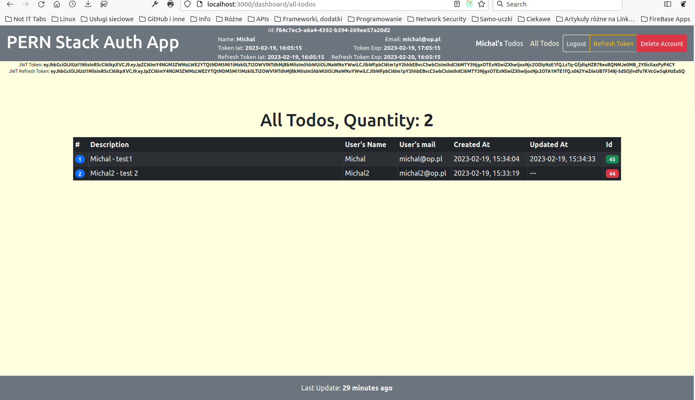
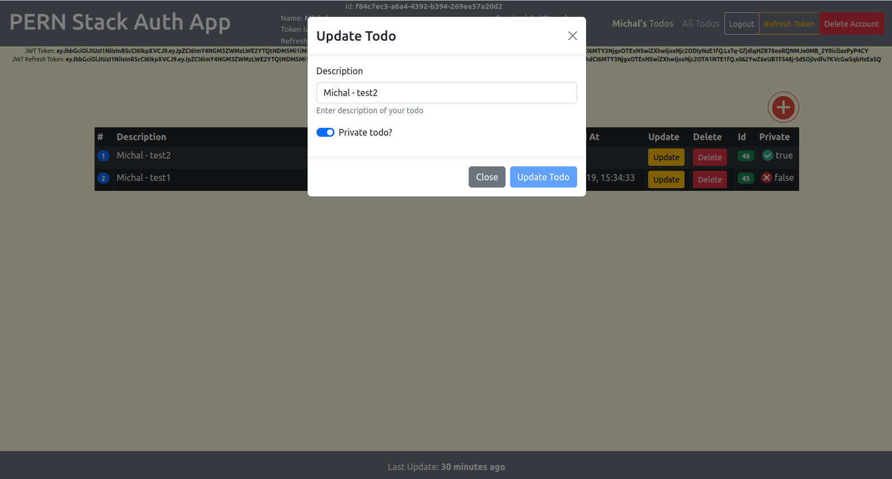
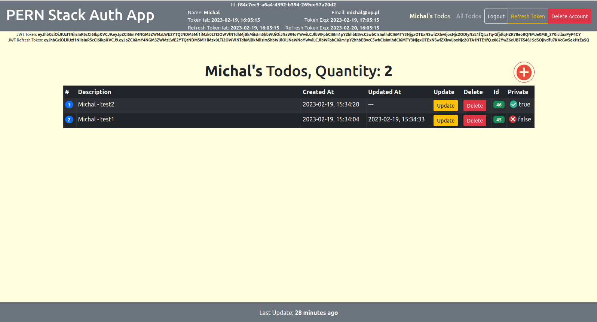

# PERN Stack App

A PERN Stack App (Auth + Todo List).

Link to the application: Coming soon...

## Description

### Motivation

This is my first [PERN stack](https://www.geeksforgeeks.org/what-is-pern-stack) application.

### General Info

This is [Crud App](https://en.wikipedia.org/wiki/Create,_read,_update_and_delete). You can login, logout, register and delete
account (this remove all todos - build with
[ON DELETE CASCADE Constraint](https://www.geeksforgeeks.org/mysql-on-delete-cascade-constraint/)). While You are logged in
you can add, update, delete your todos and read your todos and other users' todos if are not private. AutoLogout is after 10
mins of inactivity. There are axios interceptors to refresh access token.\
App is build thanks to [those tutorials](https://www.youtube.com/@TheStoicProgrammers/videos) and [this one](https://dev.to/olumidesamuel_/implementing-autologout-feature-in-web-applications-react-js-28k5).

## Notes

The .env file is not hosted on the [GitHub.com](https://github.com).\
I have some packages installed globally (e.g. TypeScript, Nodemon) so you have to install them manually.

## ScreenShots

## Built With

- The App is written in [TypeScript](https://www.typescriptlang.org).
- [React-Bootstrap](https://react-bootstrap.github.io), [Sass](https://sass-lang.com) and
  [Styled-Components](https://styled-components.com) are used to customize the UI.
- Fetching data is done by using : [Axios](https://axios-http.com).
- Client-side routing is done using: [React Router](https://v5.reactrouter.com).
- Global state of the App is maintained by: [Redux](https://redux.js.org).
- [React](https://reactjs.org) is used to build client-side.
- [Express](https://expressjs.com) is used to build server-side.
- [Node-Postgres](https://www.npmjs.com/package/pg) is used as [PostgreSQL](https://www.postgresql.org/) client for Node.js.
- [JsonWebToken](https://www.npmjs.com/package/jsonwebtoken) is used to to decode, verify and generate
  [JWT](https://en.wikipedia.org/wiki/JSON_Web_Token).
- [React Router](https://reactrouter.com/en/main) is used for client side routing.
- [JWT-decode](https://www.npmjs.com/package/jwt-decode) is used for decoding JWTs token which are Base64Url encoded.
- [Bcrypt](https://www.npmjs.com/package/bcrypt) is used to hash passwords.

## License

[MIT](https://choosealicense.com/licenses/mit)
