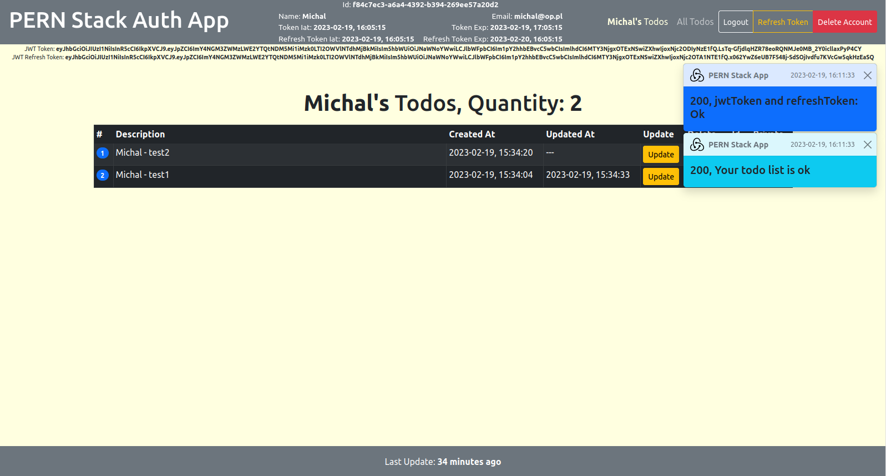

# PERN Stack App

A PERN Stack App (Auth + Todo List).

Link to the application: Coming soon...

## Description

### Motivation

This is my first [PERN stack](https://www.geeksforgeeks.org/what-is-pern-stack) application.

### General Info

This is a [Crud App](https://en.wikipedia.org/wiki/Create,_read,_update_and_delete). You can log in, log out, register and
delete account (this will remove all todos -
[ON DELETE CASCADE Constraint](https://www.geeksforgeeks.org/mysql-on-delete-cascade-constraint/)) is used. When you are
logged in you can add, update, delete your tasks and read your tasks and those of other users if they are not private.
Automatic logout is after 10 minutes of inactivity. There are axios interceptors to refresh the access token.\
App is build thanks to [these tutorials](https://www.youtube.com/@TheStoicProgrammers/videos) and [these one](https://dev.to/olumidesamuel_/implementing-autologout-feature-in-web-applications-react-js-28k5).

## Notes

The .env file is not hosted on the [GitHub.com](https://github.com).\
I have some packages installed globally (e.g. TypeScript, Nodemon) so you have to install them manually.

## Screenshots

## Built With

- The App is written in [TypeScript](https://www.typescriptlang.org).
- [React-Bootstrap](https://react-bootstrap.github.io), [Sass](https://sass-lang.com) and
  [Styled-Components](https://styled-components.com) are used to customize the UI.
- CRUD operations are performed using [Axios](https://axios-http.com).
- Client-side routing is done using [React Router](https://reactrouter.com/en/main).
- Global state of the App is maintained by [Redux](https://redux.js.org).
- [React](https://reactjs.org) is used to build client-side.
- [Express](https://expressjs.com) is used to build server-side.
- [Node-Postgres](https://www.npmjs.com/package/pg) is used as a [PostgreSQL](https://www.postgresql.org/) client for
  [Node.js](https://nodejs.org/en/).
- [JsonWebToken](https://www.npmjs.com/package/jsonwebtoken) is used to to decode, verify and generate
  [JWT](https://en.wikipedia.org/wiki/JSON_Web_Token).
- [JWT-decode](https://www.npmjs.com/package/jwt-decode) is used for decoding JWTs token which are Base64Url encoded.
- [Bcrypt](https://www.npmjs.com/package/bcrypt) is used to hash passwords.

## License

[MIT](https://choosealicense.com/licenses/mit)
